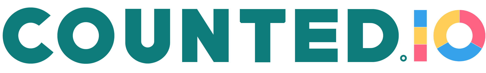

# Calorie counting doesn't have to be a full-time job. And you don't have to quit after a week, either.

Calorie counting is big in today's wellness world, and counting your calories can really help you make a difference in your health goals. Unfortunately today's calorie trackers are cumbersome to use and require you to go into countless menus and add information in completely unnatural process. 

## If you were to tell your friend what you ate today, how would you do so?
You'd probably say "Hey friend, I ate an apple for breakfast and two slices of pizza for lunch". To enter that into a calorie tracker such as myFitnessPal you'd have to fill out numerous fields. But with Counted, you can simply say just that: "I ate an apple for breakfast and two slices of pizza for lunch" and Counted will now exactly what you ate, how much you ate, what time you ate and give you back a summary of the calories you've eaten.

# Counted is live. Text +1(925)555-5555. And it's 100% free.

# Features
- Calorie tracking
- Fitness tracking
- Data visualizations
- Online profile
- Caloric information requests ("How many calories are in banana?")
- Fitness and weight goal settings

# Technologies Implemented
- Ruby
- Ruby on Rails
- ChartJS
- Twilio
- Heroku
